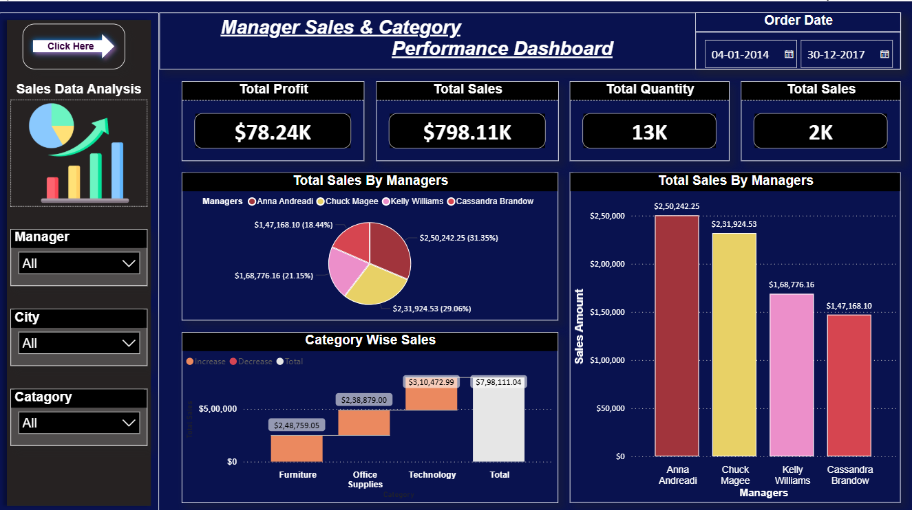
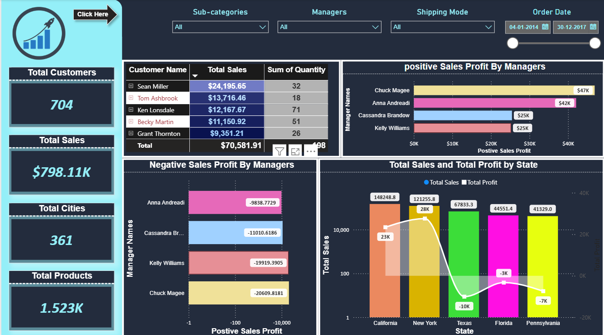
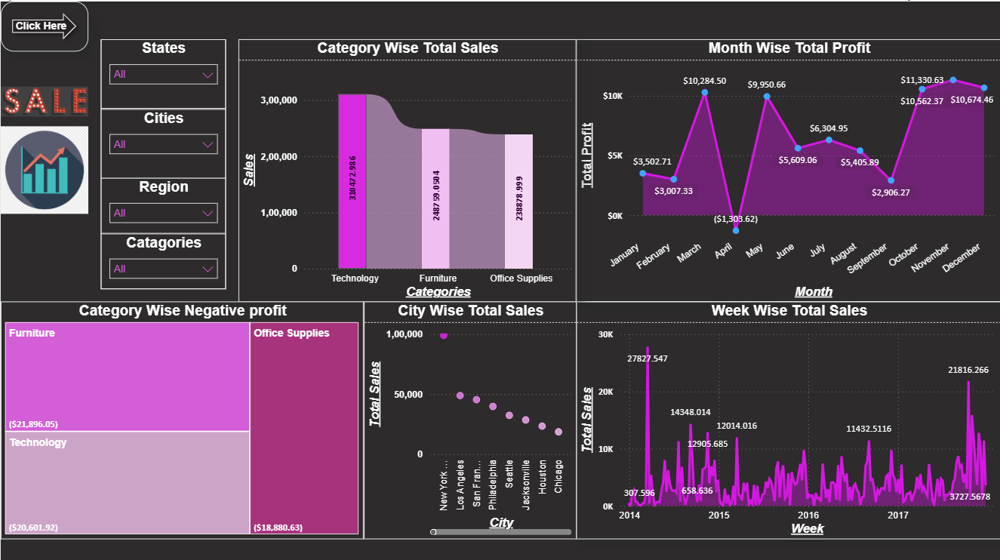
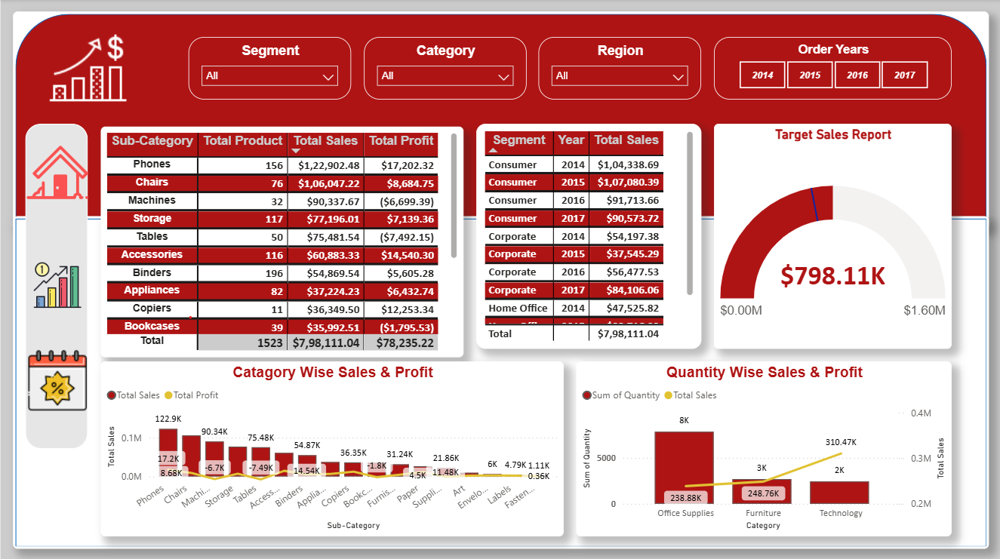

# Manager Level Sales Performance Dashboard | Power BI

## Project Overview

This Power BI dashboard provides a comprehensive analysis of sales performance, profit, customer behavior, and product trends. It uses interactive visualizations, DAX measures, and data modeling to help business users make informed decisions.

---

## Project Objectives

- Analyze Sales, Profit, Quantity, and Orders
- Monitor Sales Performance by Manager
- Identify Top Customers and Top States
- Compare Positive and Negative Sales
- Analyze Monthly and Weekly Sales Trends
- Visualize Sales by Category, City, and Region

---

## Dataset

The dashboard is built using the following tables:

- Sales
- Returns
- People

The tables are joined using appropriate relationships, with dates formatted as **MM/DD/YYYY** and currency values displayed in **US Dollars** with two decimal places. :contentReference[oaicite:0]{index=0}

---

#  Dashboard Reports

##  Report 1

### Filters
- Order Date
- City
- Region
- Category
- Sales Manager

### KPI Cards
- Total Sales
- Total Profit
- Total Quantity
- Total Order Count

### Visuals
- Sales by Manager (Pie Chart)
- Sales by Manager (Bar Chart)
- Category Sales (Waterfall Chart) :contentReference[oaicite:1]{index=1}

---

##  Report 2

### Filters
- Order Date
- Sales Manager
- Subcategory
- Ship Mode

### KPI Cards
- Total Sales
- Count of Cities
- Count of Products
- Count of Customers

### Visuals
- Top 5 Customers (Matrix)
- Positive Sales by Manager
- Negative Sales by Manager
- Top 5 States by Sales & Profit (Stacked Column Chart) :contentReference[oaicite:2]{index=2}

---

##  Report 3

### Filters
- State
- City
- Region
- Category

### Visuals
- Monthly Profit Trend (Line Chart)
- Weekly Sales Trend (Line Chart)
- Category Sales (Ribbon Chart)
- Sales by City (Scatter Chart)
- Negative Profit by Category (Tree Map)
- Quantity by City (Map) :contentReference[oaicite:3]{index=3}

---

##  Report 4

### Sample Visualizations

- Matrix Chart
- Table Chart
- Gauge Chart
- Line & Stacked Column Chart
- Line & Clustered Column Chart :contentReference[oaicite:4]{index=4}

---

#  Tools Used

- Power BI Desktop
- Power Query
- DAX
- Data Modeling

---

# Power BI Skills Demonstrated

- Data Cleaning
- Data Modeling
- Relationships
- DAX Measures
- KPI Cards
- Waterfall Chart
- Pie Chart
- Bar Chart
- Matrix
- Ribbon Chart
- Scatter Chart
- Tree Map
- Map Visual
- Gauge Chart
- Interactive Slicers

---

# 📷 Dashboard Preview

### Report 1

### Report 2

### Report 3

### Report 4

---

#  Project File

**Manager-Sales-Performance-Dashboard.pbix**

---

# Author
**Yogaraj M**

**Data Analyst | SQL | Power BI | Python | Excel**

GitHub: https://github.com/Yogaraj786
